# Voice Sandwich Demo 🥪

A real-time, voice-to-voice AI pipeline demo featuring a sandwich shop order assistant. Built with LangChain/LangGraph agents, AssemblyAI for speech-to-text, and Cartesia for text-to-speech.

## Architecture

The pipeline processes audio through three transform stages using async generators with a producer-consumer pattern:

```mermaid
flowchart LR
    subgraph Client [Browser]
        Mic[🎤 Microphone] -->|PCM Audio| WS_Out[WebSocket]
        WS_In[WebSocket] -->|Audio + Events| Speaker[🔊 Speaker]
    end

    subgraph Server [Node.js / Python]
        WS_Receiver[WS Receiver] --> Pipeline

        subgraph Pipeline [Voice Agent Pipeline]
            direction LR
            STT[AssemblyAI STT] -->|Transcripts| Agent[LangChain Agent]
            Agent -->|Text Chunks| TTS[Cartesia TTS]
        end

        Pipeline -->|Events| WS_Sender[WS Sender]
    end

    WS_Out --> WS_Receiver
    WS_Sender --> WS_In
```



### Pipeline Stages

Each stage is an async generator that transforms a stream of events:

1. **STT Stage** (`sttStream`): Streams audio to AssemblyAI, yields transcription events (`stt_chunk`, `stt_output`)
2. **Agent Stage** (`agentStream`): Passes upstream events through, invokes LangChain agent on final transcripts, yields agent responses (`agent_chunk`, `tool_call`, `tool_result`, `agent_end`)
3. **TTS Stage** (`ttsStream`): Passes upstream events through, sends agent text to Cartesia, yields audio events (`tts_chunk`)

## Prerequisites

- **Node.js** (v18+) or **Python** (3.11+)
- **pnpm** or **uv** (Python package manager)

### API Keys

| Service | Environment Variable | Purpose |
|---------|---------------------|---------|
| AssemblyAI | `ASSEMBLYAI_API_KEY` | Speech-to-Text |
| Cartesia | `CARTESIA_API_KEY` | Text-to-Speech |
| Anthropic | `ANTHROPIC_API_KEY` | LangChain Agent (Claude) |

## Quick Start

### Using Make (Recommended)

```bash
# Install all dependencies
make bootstrap

# Run TypeScript implementation (with hot reload)
make dev-ts

# Or run Python implementation (with hot reload)
make dev-py
```

The app will be available at `http://localhost:8000`

### Manual Setup

#### TypeScript

```bash
cd components/typescript
pnpm install
cd ../web
pnpm install && pnpm build
cd ../typescript
pnpm run server
```

#### Python

```bash
cd components/python
uv sync --dev
cd ../web
pnpm install && pnpm build
cd ../python
uv run src/main.py
```

## Project Structure

```
components/
├── web/                 # Svelte frontend (shared by both backends)
│   └── src/
├── typescript/          # Node.js backend
│   └── src/
│       ├── index.ts     # Main server & pipeline
│       ├── assemblyai/  # AssemblyAI STT client
│       ├── cartesia/    # Cartesia TTS client
│       └── elevenlabs/  # Alternate TTS client
└── python/              # Python backend
    └── src/
        ├── main.py             # Main server & pipeline
        ├── assemblyai_stt.py
        ├── cartesia_tts.py
        ├── elevenlabs_tts.py   # Alternate TTS client
        └── events.py           # Event type definitions
```

## Event Types

The pipeline communicates via a unified event stream:

| Event | Direction | Description |
|-------|-----------|-------------|
| `stt_chunk` | STT → Client | Partial transcription (real-time feedback) |
| `stt_output` | STT → Agent | Final transcription |
| `agent_chunk` | Agent → TTS | Text chunk from agent response |
| `tool_call` | Agent → Client | Tool invocation |
| `tool_result` | Agent → Client | Tool execution result |
| `agent_end` | Agent → TTS | Signals end of agent turn |
| `tts_chunk` | TTS → Client | Audio chunk for playback |

## Voice Evals (Audio-Only)

An audio-only, provider-agnostic eval harness lives under `components/python/src/voice_evals`.
It drives the agent under test via WebSocket and stores all audio + event logs for
manual review.

Example config: `components/python/voice_evals_config.toml`

Run (from repo root):

```bash
cd components/python
uv run python src/voice_evals/run.py --config voice_evals_config.toml
```
